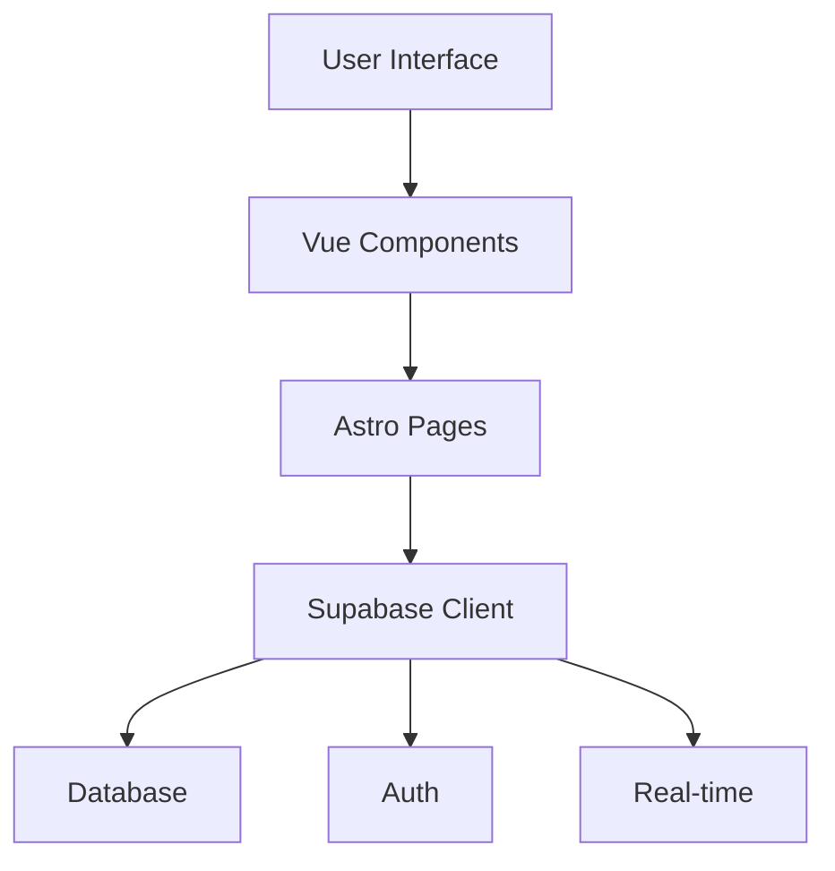

# System Patterns

## Architecture Overview

The application follows Clean Architecture and Domain-Driven Design patterns with:

- Frontend: Astro + Vue.js components
- Backend: Clean Architecture with DDD
  - Domain Layer: Entities, Value Objects, Contracts
  - Application Layer: Use Cases and Business Logic
  - Infrastructure Layer: Prisma Repositories, Database
- Database: PostgreSQL with Prisma ORM
- Deployment: Vercel

## Key Technical Decisions

1. Astro as Base Framework

   - Static site generation capabilities
   - Vue.js component integration
   - Built-in routing and layouts

2. Supabase as Backend

   - Real-time database capabilities
   - Built-in authentication
   - Row Level Security for data protection

3. Vue.js for Interactive Components
   - Component-based architecture
   - Reactive state management
   - Rich UI interactions

## Design Patterns

### Frontend Patterns

1. Component-Based Architecture

   - Reusable Vue components
   - Astro layouts for page structure
   - TailwindCSS for styling

2. State Management

   - Local component state
   - Supabase real-time subscriptions
   - Game state synchronization

3. Routing
   - Astro file-based routing
   - Dynamic route parameters
   - Protected routes

### Backend Patterns

1. Clean Architecture Layers

   - Domain: Game, Player entities with business logic
   - Application: Use cases (CreateGame, FindPlayerById, etc.)
   - Infrastructure: Prisma repositories, database access

2. Domain-Driven Design

   - Aggregates: Game contains Players
   - Repositories: Abstract interfaces in domain
   - Domain Events: For future event-driven features

3. Use Cases

   - CreateGame, FindGameById, FindAllGames
   - FindPlayerById, UpdatePlayerAction
   - VerifyGamePassword, CleanupOldGames

4. Data Access

   - Repository pattern with Prisma ORM
   - Database transactions for consistency
   - Error handling with domain exceptions

## Component Relationships

## Data Flow

1. User Authentication

   - Login/Register
   - Session management
   - Profile updates

2. Game Flow

   - Room creation
   - Player joining
   - Role assignment
   - Game state updates
   - Player actions
   - Game resolution

3. Real-time Updates
   - Game state changes
   - Player status updates
   - Chat messages
   - Voting results

## Security Patterns

1. Authentication

   - JWT-based auth
   - Session management
   - Protected routes

2. Data Protection

   - Row Level Security
   - Input validation
   - XSS prevention

3. Game Integrity
   - State validation
   - Action verification
   - Anti-cheating measures

## Testing Patterns

### Test Structure

- Use `test` instead of `it` for test cases
- Group related tests using `describe` blocks
- Keep test descriptions clear and descriptive
- Follow AAA pattern (Arrange, Act, Assert)

### Mocking

- Use Vitest's `vi.fn()` for function mocks
- Type mocks using `ReturnType<typeof vi.fn>`
- Use `vi.mock()` for module mocking
- Clear mocks in `beforeEach` with `vi.clearAllMocks()`

### Component Testing

- Use Vue Test Utils for component mounting
- Test component rendering, props, events, and slots
- Mock external dependencies and API calls
- Test error states and loading states
- Verify component interactions and state changes

### API Testing

- Mock fetch calls using `vi.fn()`
- Test success and error scenarios
- Verify API parameters and responses
- Test error handling and edge cases

### Best Practices

- Keep tests focused and atomic
- Use meaningful test descriptions
- Avoid test interdependencies
- Clean up after tests (restore mocks, clear timers)
- Test both success and failure paths
- Use type-safe mocking
