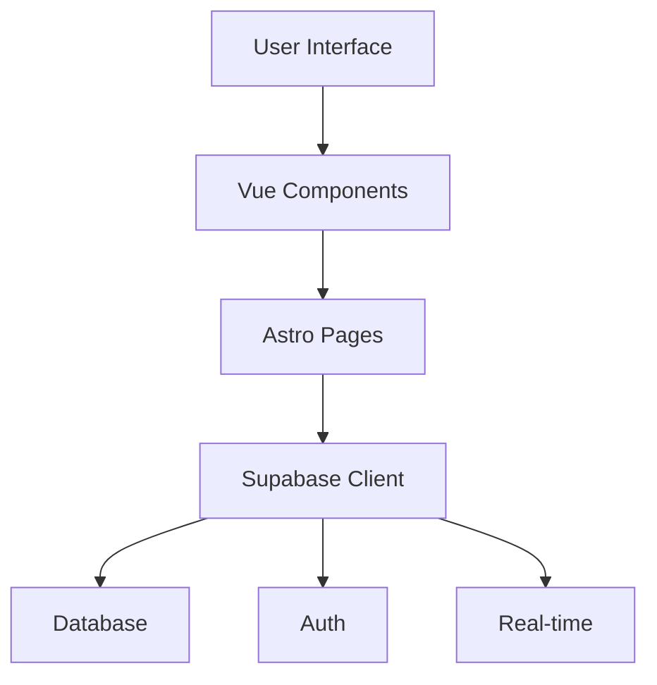

# System Patterns

## Architecture Overview

The application follows a modern web application architecture with:

- Frontend: Astro + Vue.js components
- Backend: Supabase (PostgreSQL + Real-time subscriptions)
- Authentication: Supabase Auth
- Deployment: Vercel

## Key Technical Decisions

1. Astro as Base Framework

   - Static site generation capabilities
   - Vue.js component integration
   - Built-in routing and layouts

2. Supabase as Backend

   - Real-time database capabilities
   - Built-in authentication
   - Row Level Security for data protection

3. Vue.js for Interactive Components
   - Component-based architecture
   - Reactive state management
   - Rich UI interactions

## Design Patterns

### Frontend Patterns

1. Component-Based Architecture

   - Reusable Vue components
   - Astro layouts for page structure
   - TailwindCSS for styling

2. State Management

   - Local component state
   - Supabase real-time subscriptions
   - Game state synchronization

3. Routing
   - Astro file-based routing
   - Dynamic route parameters
   - Protected routes

### Backend Patterns

1. Data Model

   - Users table
   - Games table
   - Game states table
   - Roles table

2. Real-time Updates

   - Supabase subscriptions
   - Game state broadcasting
   - Player status updates

3. Security
   - Row Level Security
   - Authentication middleware
   - Role-based access control

## Component Relationships

## Data Flow

1. User Authentication

   - Login/Register
   - Session management
   - Profile updates

2. Game Flow

   - Room creation
   - Player joining
   - Role assignment
   - Game state updates
   - Player actions
   - Game resolution

3. Real-time Updates
   - Game state changes
   - Player status updates
   - Chat messages
   - Voting results

## Security Patterns

1. Authentication

   - JWT-based auth
   - Session management
   - Protected routes

2. Data Protection

   - Row Level Security
   - Input validation
   - XSS prevention

3. Game Integrity
   - State validation
   - Action verification
   - Anti-cheating measures
